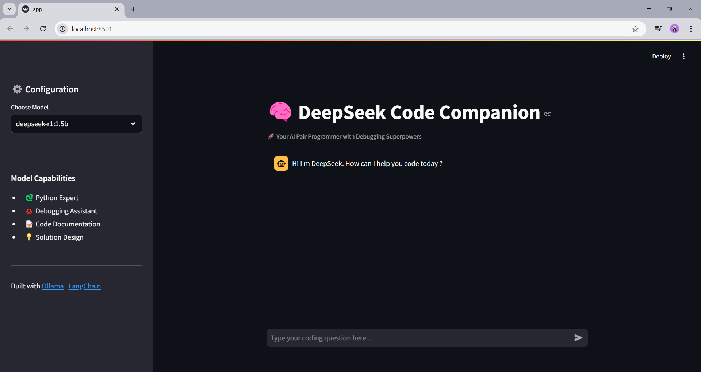
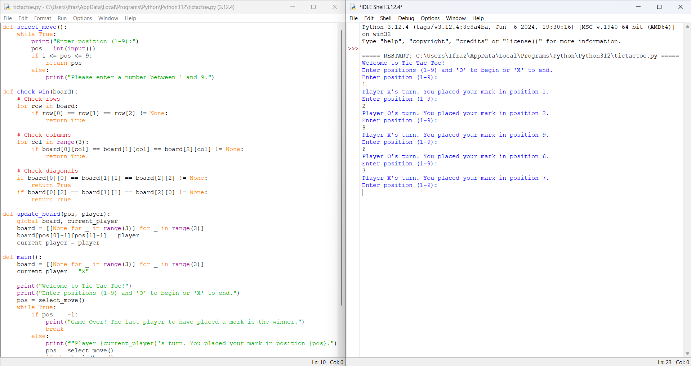

# **DeepSeek + LangChain Integration: Custom Prompt Engine & Tic-Tac-Toe Game**  

Welcome to my project repository! This project showcases the integration of **DeepSeek-V3** with **LangChain** to create a **custom Prompt Engine** using the **DeepSeek R1 (1.5B parameters)** model. Additionally, I’ve built a **Tic-Tac-Toe game** powered by the same setup to demonstrate the versatility of this integration.  

---

## **Overview**  
This project combines cutting-edge technologies to build intelligent, context-aware systems. Here’s what it includes:  
1. **Custom Prompt Engine**: A tool to generate and fine-tune prompts using **DeepSeek R1 (1.5B)**.  
2. **Tic-Tac-Toe Game**: A fun, interactive game where the AI generates moves dynamically.  
3. **Streamlit Interface**: A user-friendly UI for interacting with the system.  

---

## **Tech Stack**  
- **LangChain**: For building chain-based workflows and integrating with external data sources.  
- **Python**: The core programming language used for development.  
- **Streamlit**: For creating an interactive and intuitive user interface.  
- **Ollama**: For seamless model deployment and management.  
- **DeepSeek R1 (1.5B)**: A lightweight yet powerful LLM for prompt engineering and game logic.  

---

## **Features**  
### **1. Custom Prompt Engine**  
- Generate high-quality prompts tailored to specific use cases.  
- Fine-tune outputs by adjusting parameters dynamically.  
- Integrate with LangChain for advanced workflows like retrieval-augmented generation (RAG), summarization, and more.  

### **2. Tic-Tac-Toe Game**  
- Play Tic-Tac-Toe against an AI powered by **DeepSeek R1 (1.5B)**.  
- The AI dynamically generates moves based on the current board state.  
- Built using **Streamlit** for an interactive gaming experience.  

---

## **How It Works**  
### **Prompt Engine**  
The Prompt Engine uses **DeepSeek R1 (1.5B)** to generate and fine-tune prompts. Here’s a snippet of the core logic:  

```python
from langchain import LLMChain
from deepseek import DeepSeekModel

# Initialize DeepSeek model
deepseek_model = DeepSeekModel("deepseek-r1-1.5b")

# Generate a prompt
prompt = "Generate a creative story about a robot exploring Mars."
response = deepseek_model.generate(prompt)
print(response)
```

### **Tic-Tac-Toe Game**  
The game logic uses **DeepSeek R1 (1.5B)** to determine the best move for the AI. Here’s a sneak peek:  

```python
def generate_move(board_state, model):
    prompt = f"The current Tic-Tac-Toe board state is: {board_state}. What is the best move for 'X'?"
    move = model.generate(prompt)
    return move

# Example usage
board_state = [["X", "O", ""], ["", "X", ""], ["O", "", ""]]
best_move = generate_move(board_state, deepseek_model)
print(f"Generated Move: {best_move}")
```

---

## **Setup Instructions**  
1. Clone the repository:  
   ```bash
   git clone https://github.com/your-username/your-repo-name.git
   ```
2. Install dependencies:  
   ```bash
   pip install -r requirements.txt
   ```
3. Run the Streamlit app:  
   ```bash
   streamlit run app.py
   ```
4. Access the app in your browser at `http://localhost:8501`.  

---

## **Screenshots**  
Here are some visuals of the project in action:  

### **1. Custom Prompt Engine**  
  

### **2. Tic-Tac-Toe Game**  
  

---

## **GitHub Repository**  
For more details, check out the full code on GitHub:  
👉 [GitHub Repo Link](https://github.com/your-username/your-repo-name)  

---

## **Future Enhancements**  
- Add support for more games and interactive applications.  
- Integrate additional LLMs for comparison and benchmarking.  
- Enhance the Streamlit UI with more features and customization options.  

---

## **Let’s Connect!**  
If you’re passionate about **AI**, **prompt engineering**, or **LLMs**, let’s connect! I’d love to collaborate, hear your feedback, or discuss how we can push the boundaries of what’s possible with these technologies.  

Feel free to reach out or star the repo if you find it interesting! ⭐  

#AI #LangChain #DeepSeek #PromptEngineering #LLM #Python #Streamlit #Ollama #MachineLearning #Innovation  

--- 

**What’s your take on integrating LLMs with prompt engines? Share your thoughts below!** 👇
